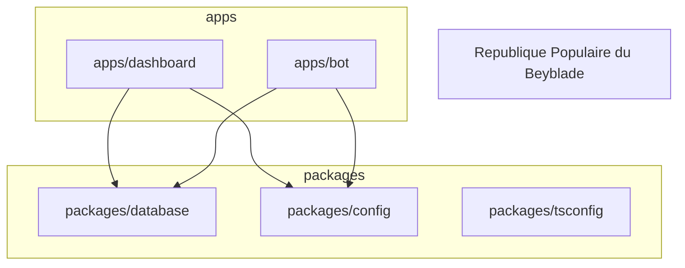

# RPB Monorepo Migration Plan

This document outlines the best practices and step-by-step plan for converting the current RPB project into a robust `pnpm` monorepo. This structure is ideal for a Next.js Dashboard + Discord Bot setup that shares a database.

## 1. Recommended Architecture

We will move from a "monolith with a bot folder" to a standard **Workspace** structure.



### Directory Structure
```
/
├── pnpm-workspace.yaml  <-- Defines the workspace
├── package.json         <-- Root scripts (dev, build, lint)
├── turbo.json           <-- (Optional) Build orchestration
├── apps/
│   ├── dashboard/       <-- Existing Next.js app (moved from root)
│   │   ├── package.json
│   │   └── next.config.ts
│   └── bot/             <-- Existing bot (moved from /bot)
│       └── package.json
└── packages/
    ├── database/        <-- SHARED PRISMA CLIENT
    │   ├── package.json
    │   ├── prisma/
    │   │   └── schema.prisma
    │   └── src/
    │       └── index.ts <-- Exports the prisma client
    ├── eslint-config/   <-- Shared ESLint rules
    └── typescript-config/ <-- Shared tsconfig.json base
```

## 2. The "Database" Package (Critical)

Currently, `prisma.ts` is duplicated. In a monorepo, the database becomes a **dependency** for both apps.

**`packages/database/package.json`**:
```json
{
  "name": "@rpb/database",
  "version": "0.0.0",
  "exports": {
    ".": "./src/index.ts"
  },
  "dependencies": {
    "@prisma/client": "^5.x",
    "prisma": "^5.x"
  },
  "scripts": {
    "generate": "prisma generate",
    "db:push": "prisma db push"
  }
}
```

**`packages/database/src/index.ts`**:
```typescript
import { PrismaClient } from '@prisma/client';

export * from '@prisma/client';

const globalForPrisma = globalThis as unknown as { prisma: PrismaClient };

export const prisma = globalForPrisma.prisma || new PrismaClient();

if (process.env.NODE_ENV !== 'production') globalForPrisma.prisma = prisma;
```

**Usage in Apps**:
Both `apps/dashboard` and `apps/bot` will have `"@rpb/database": "workspace:*"` in their dependencies and simply `import { prisma } from '@rpb/database'`.

## 3. Migration Steps

### Phase 1: Preparation (Safe)
1.  **Create Directories**: `mkdir -p apps packages/database`
2.  **Setup Workspace**: Update `pnpm-workspace.yaml`:
    ```yaml
    packages:
      - 'apps/*'
      - 'packages/*'
    ```

### Phase 2: Migration (Disruptive)
1.  **Move Bot**: Move `root/bot` -> `root/apps/bot`.
2.  **Move Dashboard**: Move root source files (`src`, `public`, `next.config.ts`, etc.) -> `root/apps/dashboard`.
3.  **Extract Database**:
    *   Move `prisma/` folder -> `packages/database/prisma/`.
    *   Initialize `packages/database` with `package.json`.
4.  **Fix Imports**: Update all `import { prisma }` calls to point to the new package.

### Phase 3: Deployment (Coolify)
The `Dockerfile` needs a major update to support the monorepo build context. It will need to:
1.  Copy `pnpm-lock.yaml` and `pnpm-workspace.yaml`.
2.  Copy all `package.json` files to install dependencies (using `pnpm fetch` or `turbo prune` is best practice).
3.  Build the specific app (Dashboard or Bot).

## 4. Benefits
*   **Single Source of Truth**: Database schema changes instantly reflect in both Bot and Dashboard types.
*   **Smaller Builds**: The Bot doesn't need Next.js dependencies, and the Dashboard doesn't need Discord.js.
*   **Cleaner CI/CD**: You can lint/test only what changed.

## Next Steps
To begin this migration, run:
`mkdir -p apps packages/database`
Then move the bot and create the database package.

## Verified References (Context7)
The strategies in this plan are validated by the following official documentation:
*   **pnpm Workspaces**: `/pnpm/pnpm.io` - Confirms `pnpm-workspace.yaml` structure.
*   **Turborepo**: `/websites/turborepo` - Confirms "Internal Package" pattern for shared database.
*   **Next.js Monorepo**: `/belgattitude/nextjs-monorepo-example` - Reference architecture for Next.js + Shared Libs.
